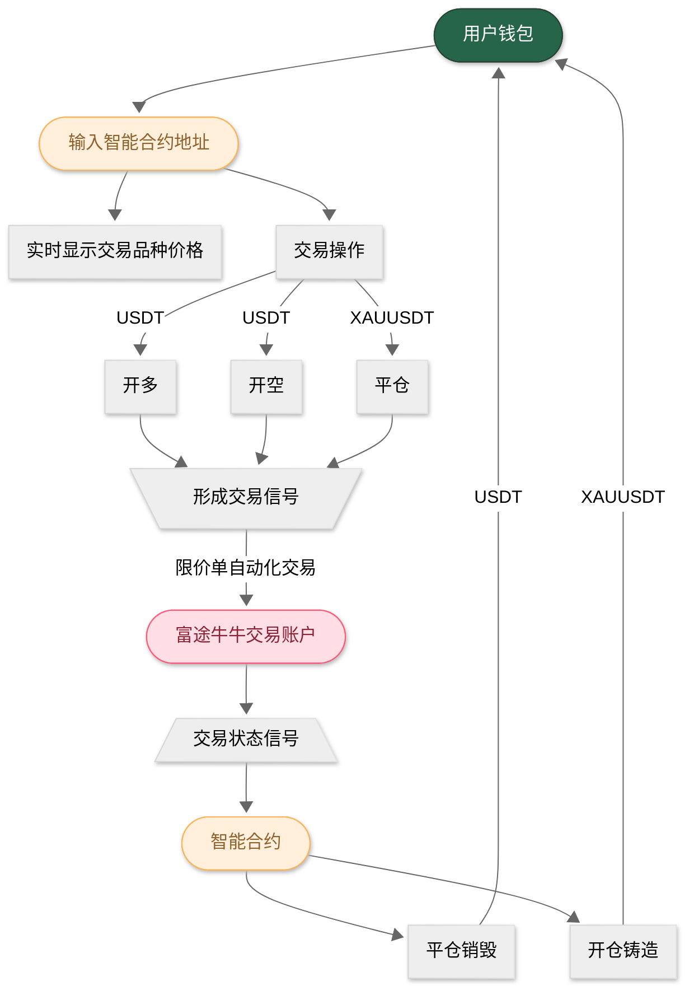

# XAUUSDT项目需求文档

## 项目待解决要点
    1. 券商账户的操作服务器是否要放在香港境内/香港境内的云服务商（机房在香港），需要查询证监会的要求。
    2. 要求在券商账户中新增一个子账户，子账户实盘最高金额为1000美元。
    3. 如何在一个智能合约里实现不同的杠杆倍数与开空？
    4. 交易杠杆倍率是否可以调整？MVP在去中心化交易所如何实现交易杠杆倍率的调整？
    5. 已开发好的智能合约如何确保登录在UNISWAP？
    6. 交易信号鉴权，确保是真实的链上交易信号。

## 项目概述
    1. 项目名称：XAUUSDT
    2. 项目描述：黄金代币交易智能合约，用户通过去中心化交易所，或者直接通过智能合约，使用USDT购买XAUUSDT代币，XAUUSDT代币价格与黄金价格挂钩，用户可以跟随交易所时间卖出代币，获取USDT。
       1. 智能合约部署在BSC链上
       2. 用户用usdt操作智能合约，智能合约根据用户的操作信息，自动操作富途牛牛的证券账户。
       3. 证券账户返回的交易状态，智能合约根据交易状态，实现代币的铸造/销毁。
    3. MVP版本要求：
       1. 智能合约部署在BSC主网
       2. 交易品种：1OZmain 1盎司黄金主连（到期后是自动续期吗？，这个交易品种是因为合约价值*1美元）；另一个选择是GCmain 黄金主连（合约价值*100美元）
       3. 交易账户：富途牛牛
       4. 交易能力：限价单；开多、开空、平仓；是否能碎股交易？是不是交易账户自带的能力？

## 项目业务逻辑流程图

## 项目开发重点
    1. 交易品种规则对齐
    2. 交易账户能力对齐
    3. 以交易账户的交易状态作为实现代币铸造/销毁的依据。
    4. 智能合约要能实时显示交易品种的价格。
    5. 要求整个项目可以用AI快速复制为其他相同交易规则的其他产品。

## 交易品种选择标准
    1. 美股选7*24小时交易；交易量从大到小排序。
    2. 期货选主链交易量大的品种。

## 开发计划
    1. 智能合约BSC测试网络+券商账户模拟盘
    2. 智能合约BSC主网+券商账户模拟盘
    3. MVP版本：智能合约BSC主网+券商账户实盘 （1000u+1000美金）
    4. 正式版：智能合约BSC主网+券商账户实盘+多交易品种+DAPP

## 合规要点
    1. 香港稳定币
    2. 证券交易走的是香港做市商的通道（robinhood/PFOF）
    3. 我们只是链上的工具，不涉及KYC与入金出金
    4. 智能合约一笔订单应当拆分成多笔订单，通过不同交易账户实现交易，避免被追踪到。（所以不能上冷门交易产品）

## 富途牛牛API文档
    1. [富途牛牛API文档](https://openapi.futunn.com/futu-api-doc/ftapi/init.html)

## BSC文档
    1. [BSC文档](https://docs.bnbchain.org/bnb-smart-chain/developers/quick-guide/)

